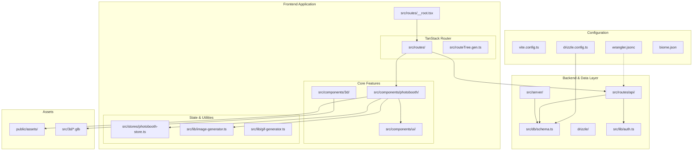

# OurBooth: Architecture & Repository Overview

OurBooth is a high-performance, full-stack virtual photo booth application built with a modern web stack, optimized for edge deployment.

## Technical Stack

- **Framework:** [TanStack Start](https://tanstack.com/router/v1/docs/guide/start) (Full-stack React with Vite)
- **Deployment:** [Cloudflare Workers](https://workers.cloudflare.com/)
- **Database:** [Neon](https://neon.tech/) (Serverless Postgres)
- **ORM:** [Drizzle ORM](https://orm.drizzle.team/)
- **3D Engine:** React Three Fiber / Three.js
- **State Management:** [Zustand](https://github.com/pmndrs/zustand) (inferred from store pattern)
- **UI Components:** [Radix UI](https://www.radix-ui.com/) / [Shadcn UI](https://ui.shadcn.com/)

---

## Repository Structure

---

## Key Directories

- `src/routes/`: Contains the file-based routing system.
- `src/components/photobooth/`: The core logic for the photo booth experience (camera, stickers, templates).
- `src/lib/`: Core utility libraries for image and GIF generation.
- `src/server/`: Server-side functions and logic.
- `src/db/`: Database schema and connection configuration.
- `public/assets/images/stickers/`: Static assets for the sticker overlay feature.

## Application Routes

### Core Pages
- **`/`**: Home Page
- **`/create`**: Main Photo Booth Experience
- **`/photos`**: Photo Gallery
- **`/auth/signin`**: User Sign In
- **`/auth/signup`**: User Registration

### API Endpoints
- **`/api/auth/$`**: Authentication Handlers (Wildcard)

### Developer Demos
- **`/demo/*`**: Various technical demos for Drizzle, Neon, SSR modes, and TanStack Query.
